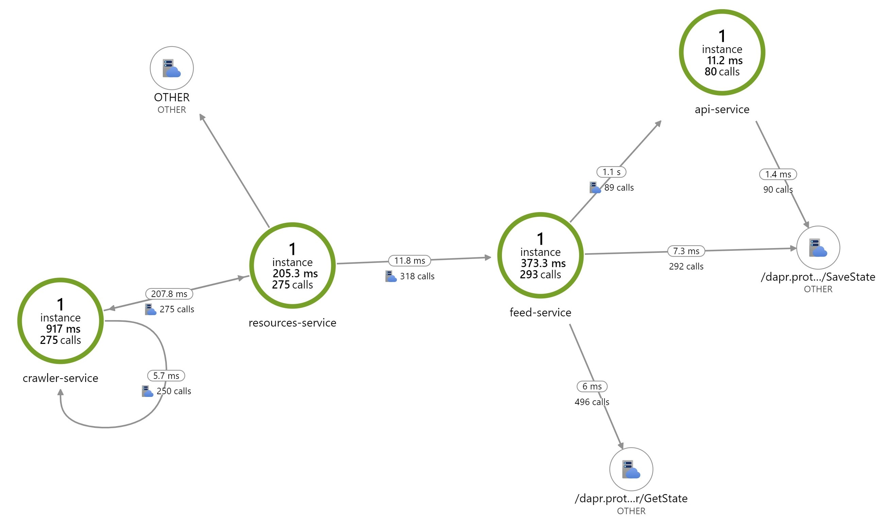

# Megaphone

## Why Megaphone?

This is a tool I use to help me keep track of all the updates and announcements.

Azure and the Dev world evolves at a terrying pace! Keeping up with it all takes time and generates unnunnecessary cognitive load... Megaphone is all about streamlining my workflow and drastically reducing the cognitive load required to stay current on this ever chaning world.

## Approach

Megaphone is built as an exploration, to learn various technologies and act as a demoable solution. 

The technologies explored so far are as follows:

### Dapr

The Dapr documendation provides a solid overview of the [concepts](https://github.com/dapr/docs/tree/master/concepts) used below :

- [Actors](https://github.com/dapr/docs/blob/master/concepts/actors/README.md)
  - [dotnet](https://github.com/dapr/dotnet-sdk/blob/master/docs/get-started-dapr-actor.md)
- [Bindings](https://github.com/dapr/docs/blob/master/concepts/bindings/README.md) ([Azure Storage Queue](https://github.com/dapr/docs/blob/master/reference/specs/bindings/storagequeues.md)/ [RabbitMQ](https://github.com/dapr/docs/blob/master/reference/specs/bindings/rabbitmq.md))
- [PubSub](https://github.com/dapr/docs/blob/master/concepts/publish-subscribe-messaging/README.md) (Redis/[Azure Service Bus Topics](https://github.com/dapr/docs/blob/master/howto/setup-pub-sub-message-broker/setup-azure-servicebus.md))
  - [Cloud Events](https://github.com/cloudevents/spec/tree/v0.3)
- [Secrets](https://github.com/dapr/docs/blob/master/concepts/secrets/README.md) ([Azure Keyvault](https://github.com/dapr/docs/blob/master/howto/setup-secret-store/azure-keyvault.md))
- [Service Invocation](https://github.com/dapr/docs/blob/master/concepts/service-invocation/README.md)
- [State](https://github.com/dapr/docs/blob/master/concepts/state-management/README.md) ([Redis](https://github.com/dapr/docs/blob/master/howto/setup-state-store/setup-redis.md) / [Azure Cosmos DB](https://github.com/dapr/docs/blob/master/howto/setup-state-store/setup-azure-cosmosdb.md))
- [Observability](https://github.com/dapr/docs/blob/master/concepts/observability/README.md) 
  - Distributed Tracing ([Azure Application Insights](https://github.com/dapr/docs/blob/master/howto/diagnose-with-tracing/azure-monitor.md))
- [Rate limiting an application](https://github.com/dapr/docs/tree/master/howto/control-concurrency)

### ASP .NET Core

- [ASP.NET Web APIs](https://dotnet.microsoft.com/apps/aspnet/apis)
- [Background tasks with hosted services in ASP.NET Core](https://docs.microsoft.com/en-us/aspnet/core/fundamentals/host/hosted-services?view=aspnetcore-3.1&tabs=visual-studio)

### Local Development

- [Debugging Dapr applications with Visual Studio Code](https://blog.ehn.nu/2020/03/debugging-dapr-applications-with-visual-studio-code/)
- [Dapr for Visual Studio Code (Preview)](https://github.com/microsoft/vscode-dapr) ([marketplace](https://marketplace.visualstudio.com/items?itemName=ms-azuretools.vscode-dapr))
  - [tasks.json](./.vscode/tasks.json)
  - [launch.json](./.vscode/launch.json)

## Design

See [design docs](./docs/design.md) for more details.

### Megaphone Organic View genetated by Azure Application Insights

