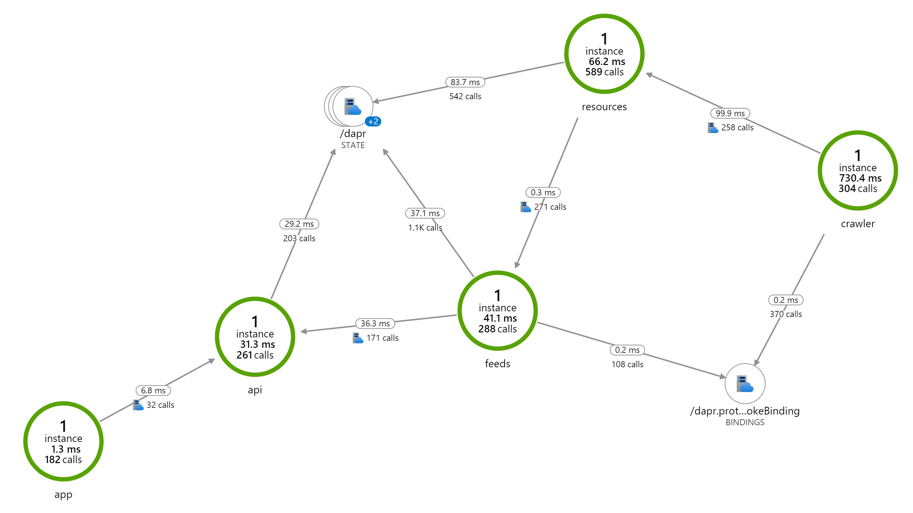

# Megaphone

## Why Megaphone

This is a tool I use to help me keep track of all the updates and announcements.

Azure and the Dev world evolves at a terrying pace! Keeping up with it all takes time and generates unnunnecessary cognitive load... Megaphone is all about streamlining my workflow and drastically reducing the cognitive load required to stay current on this ever chaning world.

## Approach

Megaphone is built as an exploration, to learn various technologies and act as a demoable solution.

# High Level Design

The following is the high level design of Megaphone. It leverages [Dapr](http://dapr.io), an event-driven, portable runtime for building microservices on cloud and edge. Dapr is currently under community development in preview phase and master branch could include breaking changes.

Dapr is language agnostic and provides a [RESTful HTTP API](https://github.com/dapr/docs/blob/master/reference/api/README.md) in addition to the protobuf clients. Megaphone uses the RESTful API for the Crawler service and leverages the [Dapr SDK for .NET](https://github.com/dapr/dotnet-sdk) for the other services.