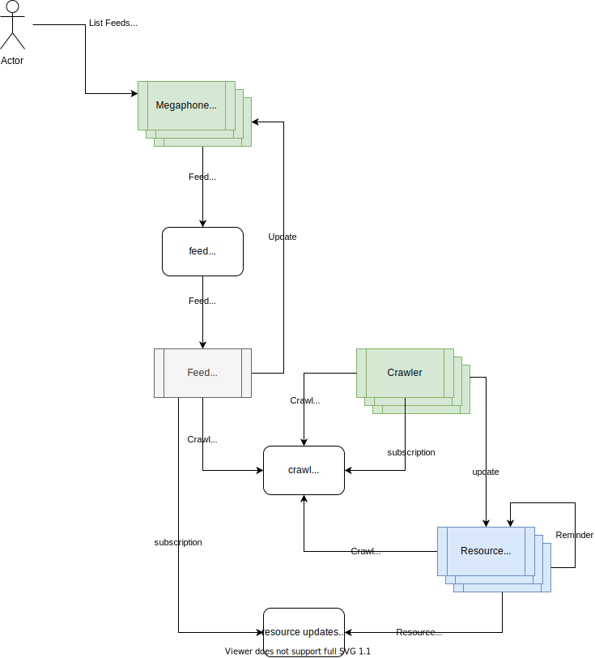

# High Level Design

The following is the high level design of Megaphone. This is built with [Dapr](http://dapr.io), an event-driven, portable runtime for building microservices on cloud and edge. Dapr is currently under community development in preview phase and master branch could include breaking changes.

Dapr is language agnostic and provides a [RESTful HTTP API](https://github.com/dapr/docs/blob/master/reference/api/README.md) in addition to the protobuf clients. Megaphone uses the RESTful API for the Crawler service and leverages the [Dapr SDK for .NET](https://github.com/dapr/dotnet-sdk) for the other services.

## Architecture Design

### Application Flows

#### Delete Feed

- HTTP DELETE api/feeds/{id} on API Service
  - API Service retreives Feed list view from Dapr state store
  - API Service publishes Delete Feed event to queue

- Feed service triggered by Dapr via queue Binding
  - Feed Service acts on Delete Feed event. Deletes feed from Feed list and persists list in Dapr state store.

- Feed Service Heart Beat Hosted Service triggers every 30 seconds
  - If Feed list ETag is different, materialize Feed View and Invoke HTTP PUT method on API Service to publish external materialized view of Feed List.

#### Update Feeds

- HTTP PUT Feed list view to api/feeds on API Service
  - API Service stores Feed list view in Dapr state store

#### List Feeds

- HTTP GET api/feeds on API Service
  - API Service returns Feed list view stored in Dapr state store

#### Add Feed

- HTTP POST feed url to api/feeds on API Service

- API Service publishes Add Feed event to queue

- Feed service triggered by Dapr via queue Binding
  - Feed Service acts on Add Feed event. Adds feed to list and persists list in Dapr state store.
    - Feed Service publishes Crawl event to crawl PubSub topic

- Crawl service triggered by Dapr via PubSub subscription
  - Crawl Service pull provided url
    - Crawler service publishes Crawl event to crawl PubSub topic for each recource found in the feed.
  - Crawler Service invokes the Update method of the Resource Actor

- Resource Actor applies Update
  - If change is detected, Resource Actor publishes Resource Update event to the recource update PubSub topic
  - Resource Actor registers Reminder to publish a Crawl event to crawl PubSub topic to trigger a re-crawl based on a crawl strategy.

- Feed Service triggered by Dapr via PubSub subscription
  - Feed Service applies updates to internal Feed list and persists via Dapr state store

- Feed Service Heart Beat Hosted Service triggers every 30 seconds
  - If Feed list ETag is different, materialize Feed View and Invoke HTTP PUT method on API Service to publish external materialized view of Feed List.

## Organic View genetated by Azure Application Insights

## Hierarchical View genetated by Azure Application Insights

